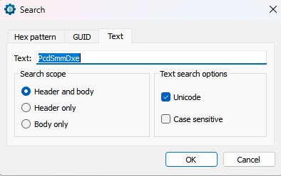
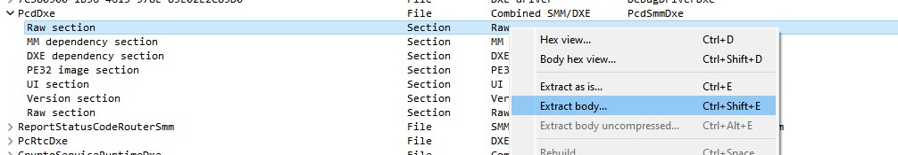
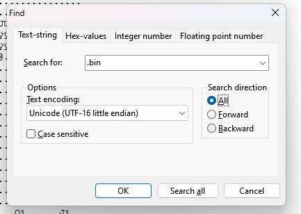
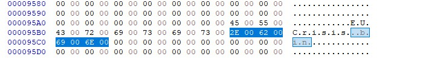

# What is this?
InsydeH2O BIOS has a modality, called Crisis Mode, that allows you to flash a BIOS from a USB Stick.
This means that you can use it to flashback **"semi-bricked"** bios

# Will this work? Is my bios **"semi-bricked"** or bricked? 
A good way to tell if this method works is by looking at the behavior of the Laptop when trying to power on.

### When this will not Work:
- After plugging the cable, the laptop power-on immediately, and power off after a couple of seconds
- The laptop automatically power off after a couple of second after pressing the power button

### When this might Work:
- After pressing the power button, it stays on, and you can interact with it
    > for example on RGB Model Fn+Space, change the Keyboard Light
- Bios stuck in Self-Healing status
- Any other thing that makes you fill that is not fully bricked:
    > A wrong bios setting, for example, is one of these cases

# How to do it
## Tool Needed
- [InnoExtract](https://github.com/dscharrer/innoextract/releases)
- [7zip](https://www.7-zip.org/download.html)
>The following two are needed only if, on step 5, your bios is not in the know one...
- [UEFITOOL](https://github.com/LongSoft/UEFITool/releases)
- Hex Editor, In this guide will be used [HxD](https://mh-nexus.de/en/hxd/)

## 0. Extract the Tool 
Extract/Install the Downloaded Tool

## 1. Grab the Bios
Download the bios file from the [Lenovo Support Website](https://pcsupport.lenovo.com/)

## 2. Extract the BIOS from the EXE
Put the Bios Exe File in the same directory as the `innoextract.exe` binary.

Drag and drop the Bios Exe over the innoextract binary
_(or do from the CLI calling `innoextract.exe` and giving as first argument the bios exe file name)_

## 3. Extract the Rom
This will create a new folder (typically called `app` or `code$GetExtractPath`), open it, and there will another exe.

Open It with 7z, and extract the BIOS ROM, normally called `BIOS.fd`, but can have a different name, but has always a size around 16 Mb (24Mb for 2022 Model).

## 4. Rename the file to the proper name
If your bios name is in this table, rename the just extracted rom to that name *(Crisis Name)*, and **jump to step 6**.

|BIOS Type  | Crisis Name   |
|-----------|---------------|
|EUCN       | EUCrisis.bin  |
|BHCN       | BHCrisis.bin  |
|H1CN       | h1cn.bin      |
|GKCN       | gkcn.bin      |
|KWCN       | kwcn.bin      |
|JNCN       | jncn.bin      |

## 5. Find the Crisis Name
 * Open The ROM File in UefiTool
 * Search for the `PcdSmmDxe` Unicode String

* There will be just one result double click on it
* Now click on the Raw Section of the `PcdSmmDxe` and extract it as body

* Open the extracted File with the Hex editor
* Search for the `.bin` UNICODE/UTF-16 string 
* 

* There will be only one match
* 

* The fileName to use is there, in this case, is `EUCrisis.bin`, *ignore the dot, between every letter as is the UTF16 Padding (0x00 byte)*

> If you are on Linux, or you have Linux Binutils on windows, you can skip all the Hexeditor parts and just run `strings.exe .\Section_Raw_PcdDxe_PcdSmmDxe_body.raw -eb | grep .bin` in a terminal and the name will be there

## 6. Create The USB
Create a FAT32, GPT formatted USB Stick, and copy in the root the file just renamed...

The result needs to be a USB stick, with in the root a file with the right name ending in `.bin`

## 7. Flash the BIOS

**The Beep is damn loud and will last for 8-10min, so don't do this at night**
> If you have self healing problem is suggested also to remove the SSD, (The Self Healing File is on SSD, so removing it will not trigger the process again after the flash)
* Remove the Power plug
* Make sure that le laptop is off, pressing the power button for > 30 sec
* Plug the USB
* Press and keep pressed FN + R
* Plug the charger
* Press the power button
* The led near the Power connector will start blinking
* Keep FN + R pressed until the computer starts Beeping, can take 2-5 min, don't give up early, once start beeping can release the key, after a couple of beeps
* wait for it to finish, will reboot automatically when done

## 8. Finishing Touches
If all is gone well the laptop will boot just fine,
to complete the setup are needed a couple of other Steps:

If the restored BIOS version was not the same as the old one, you will see that the EC Version and the BIOS version are Different so:
* Got to Bios and Enable `BIOS Flashback`, Boot into windows, and do a normal install of the same bios, this will update also the EC firmware

After that go to Bios, Security Tab, and Use Restore Factory Key, this will put the Bios in UserMode, and will Setup the Key for secure Boot.
**If you don't do this the Bios will be in Setup mode, and even if you enable SecureBoot, it will remain disabled**

# Credit
[Original Post On the Lenovo Forum](https://forums.lenovo.com/t5/Gaming-Laptops/Y540-BIOS-Recovery-Mode-Flash-BIOS-from-USB/m-p/5026109?page=1)

# Special Thanks
[Legion Series Comunity](https://discord.gg/legionseries)
